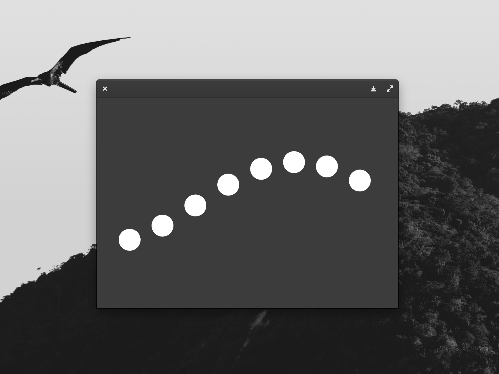

# ofPortedApp

A simple port of a JavaScript App from last Semester demonstrating the offsetting sine functions.

In this exercise I learned how to set up and compile a project in OpenFrameworks, and how to write basic C++ code.
Additionally, this exercise also uses simple built-in OF functions such as `ofCirlce()` and `ofGetElapsedTimeMillis()`.

